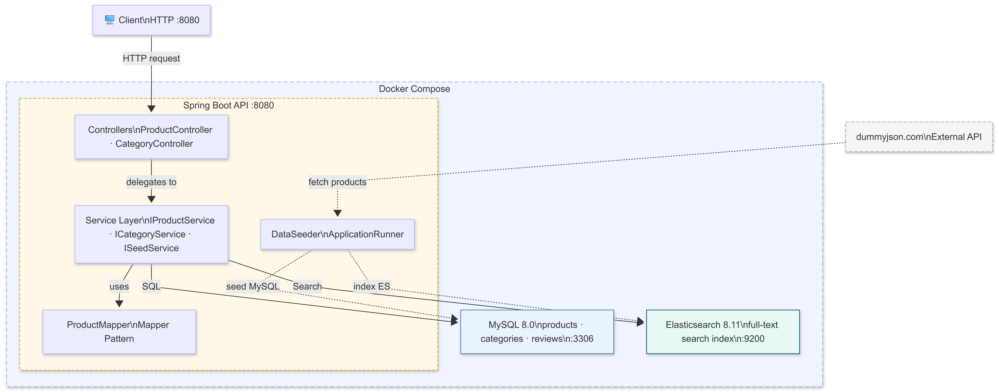
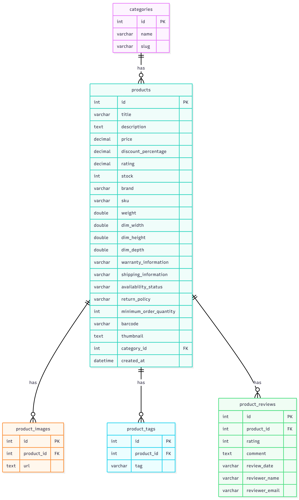

# E-Commerce REST API

A production-quality e-commerce REST API built with **Java 17**, **Spring Boot 3.2**,
**MySQL 8**, and **Elasticsearch 8.11** — fully containerised with Docker Compose.

---

## Quick Start

**Prerequisites:** Docker ≥ 24 and Docker Compose ≥ 2 (bundled with Docker Desktop).

That is the only command needed.
Docker Compose starts MySQL and Elasticsearch with health checks, waits until both
are healthy, then boots the Spring Boot application. On first startup the `DataSeeder`
automatically fetches all products from `dummyjson.com`, populates MySQL, and
bulk-indexes into Elasticsearch.

| URL | Purpose |
|-----|---------|
| `http://localhost:8080` | API base URL |
| `http://localhost:8080/actuator/health` | Health check |
| `http://localhost:9200` | Elasticsearch (direct, for debugging) |

> **Windows users:** If port 3306 is already in use by a local MySQL installation,
> change the mysql ports line in `docker-compose.yml` from `"3306:3306"` to `"3307:3306"`.

---

## API Endpoints

| Method | Path | Data Source | Description |
|--------|------|-------------|-------------|
| `GET` | `/categories` | MySQL | List all categories |
| `GET` | `/products` | MySQL | Paginated product list |
| `GET` | `/products?query={q}` | Elasticsearch | Full-text search |
| `GET` | `/products?category={cat}` | MySQL | Filter by category |
| `GET` | `/products?query={q}&category={cat}` | Elasticsearch + filter | Search within category |
| `GET` | `/products/{id}` | MySQL | Single product by ID |

### Query parameters for `/products`

| Parameter  | Type    | Default | Constraints | Description |
|------------|---------|---------|-------------|-------------|
| `query`    | string  | —       | —           | Full-text search — routes to Elasticsearch |
| `category` | string  | —       | —           | Category name or slug — filters in MySQL |
| `page`     | integer | `0`     | ≥ 0         | Zero-based page index |
| `size`     | integer | `30`    | 1–100       | Items per page |

### Example requests

```bash
# Health check
curl http://localhost:8080/actuator/health

# All products (paginated)
curl http://localhost:8080/products

# Paginate
curl "http://localhost:8080/products?page=1&size=10"

# Full-text search (Elasticsearch)
curl "http://localhost:8080/products?query=wireless+headphones"

# Filter by category (MySQL)
curl "http://localhost:8080/products?category=smartphones"

# Combined: search within a category
curl "http://localhost:8080/products?query=apple&category=smartphones"

# Single product by ID (404 if not found)
curl http://localhost:8080/products/1

# All categories
curl http://localhost:8080/categories
```

### Response shape — `GET /products/{id}`

```json
{
  "id": 1,
  "title": "Essence Mascara Lash Princess",
  "description": "The Essence Mascara Lash Princess is a popular mascara...",
  "price": 9.99,
  "discountPercentage": 10.48,
  "rating": 2.56,
  "stock": 99,
  "brand": "Essence",
  "sku": "BEA-ESS-ESS-001",
  "thumbnail": "https://cdn.dummyjson.com/.../thumbnail.webp",
  "category": "beauty",
  "availabilityStatus": "In Stock",
  "warrantyInformation": "1 week warranty",
  "shippingInformation": "Ships in 3-5 business days",
  "returnPolicy": "No return policy",
  "minimumOrderQuantity": 48,
  "weight": 4.0,
  "dimWidth": 15.14,
  "dimHeight": 13.08,
  "dimDepth": 22.99,
  "barcode": "5784719087687",
  "images": [
    "https://cdn.dummyjson.com/.../1.webp"
  ],
  "tags": ["beauty", "mascara"],
  "reviews": [
    {
      "rating": 5,
      "comment": "Highly impressed!",
      "reviewDate": "2025-04-30T09:41:02.053Z",
      "reviewerName": "Eleanor Collins"
    }
  ],
  "createdAt": "2024-03-01T10:00:00"
}
```

### Response shape — `GET /products` (list)

```json
{
  "total": 194,
  "page": 0,
  "size": 30,
  "data": [ { ...product... }, { ...product... } ]
}
```

### Response shape — `GET /products?query=mascara` (search)

```json
[
  { "id": 1, "title": "Essence Mascara Lash Princess", ... },
  { "id": 7, "title": "Red Lipstick", ... }
]
```

### Error response

```json
{
  "status": 404,
  "error": "Not Found",
  "message": "Product not found with id: '999'",
  "path": "/products/999",
  "timestamp": "2024-03-01T10:30:00"
}
```
---

## System Architecture

<p align="center">
  
</p>

---

## Project Structure

```
ecommerce-api/
├── Dockerfile                              # Multi-stage build (builder + runtime)
├── docker-compose.yml                      # MySQL + Elasticsearch + API
├── pom.xml                                 # Maven dependencies
└── src/main/java/com/ecommerce/api/
    ├── EcommerceApiApplication.java         # @SpringBootApplication entry point
    │
    ├── config/
    │   └── AppConfig.java                  # RestTemplate bean, CORS config
    │
    ├── controller/                         # HTTP layer — thin, no business logic
    │   ├── ProductController.java
    │   └── CategoryController.java
    │
    ├── service/                            # Interfaces (contracts)
    │   ├── IProductService.java
    │   ├── ICategoryService.java
    │   ├── ISeedService.java
    │   └── impl/                           # Concrete implementations
    │       ├── ProductServiceImpl.java
    │       ├── CategoryServiceImpl.java
    │       └── SeedServiceImpl.java
    │
    ├── mapper/
    │   └── ProductMapper.java              # All object-to-object conversions
    │
    ├── model/                              # JPA entities (MySQL schema)
    │   ├── Category.java
    │   ├── Product.java
    │   ├── ProductImage.java
    │   ├── ProductTag.java
    │   └── ProductReview.java              # ← maps to product_reviews table
    │
    ├── document/
    │   └── ProductDocument.java            # Elasticsearch document
    │
    ├── repository/                         # Spring Data interfaces
    │   ├── CategoryRepository.java
    │   ├── ProductRepository.java
    │   └── ProductSearchRepository.java
    │
    ├── dto/                                # Data Transfer Objects
    │   ├── DummyProduct.java               # dummyjson API response (full field set)
    │   ├── DummyJsonResponse.java          # dummyjson top-level wrapper
    │   ├── DummyDimensions.java            # nested dimensions object
    │   ├── DummyReview.java                # nested review object
    │   ├── DummyMeta.java                  # nested meta object (barcode, dates)
    │   ├── ProductResponse.java            # API outbound (full field set)
    │   ├── ReviewResponse.java             # nested inside ProductResponse
    │   ├── CategoryResponse.java           # API outbound
    │   └── ApiListResponse.java            # Generic paginated wrapper
    │
    ├── exception/
    │   ├── ResourceNotFoundException.java
    │   ├── ErrorResponse.java
    │   └── GlobalExceptionHandler.java
    │
    └── runner/
        └── DataSeeder.java                 # ApplicationRunner — triggers seed on boot
```

---

## MySQL Schema

<p align="center">
  
</p>

### Schema design rationale

**Why normalise categories?**
A plain `VARCHAR` category column on every product row would duplicate the string
10–20 times and make category filtering a full string scan. With a FK to `categories`,
the join is an integer comparison on an indexed primary key — much faster at scale.

**Why separate child tables for images, tags, and reviews?**
Arrays cannot be indexed in relational databases. Separate child tables make each
row individually queryable, avoid unindexable JSON blob columns, support cascade
deletes automatically, and allow adding metadata later (e.g. `is_primary` on images)
without a schema redesign.

**Why store dimensions as three flat columns?**
`dim_width`, `dim_height`, `dim_depth` are flat on the `products` row because it
is a strict 1-to-1 relationship. A separate `product_dimensions` table would add
a join for no benefit. Flat columns are also directly usable in `WHERE` clauses
(e.g. filter by weight or size range).

**Why use dummyjson's own id as the primary key?**
Avoids a mapping table. The external source id is stable and unique, so there is
no collision risk when re-seeding. It also makes the API URL `/products/1` match
the source data without any translation.

---

## Elasticsearch Index

```
Index:    products
Shards:   1  (single-node dev setup)
Replicas: 0

Field mapping:
  id                    integer
  title                 text (standard analyser) + keyword sub-field
  description           text (standard analyser)
  price                 float
  discount_percentage   float
  rating                float
  stock                 integer
  brand                 keyword   ← exact match, not tokenised
  category              keyword   ← exact match for bool filter clause
  thumbnail             keyword, index:false  ← stored, never searched
  images                keyword, index:false
  tags                  keyword
  created_at            date
```

> Reviews, dimensions, SKU, barcode, warranty and shipping fields are stored in
> MySQL only. Elasticsearch holds only the fields needed for ranking and filtering —
> MySQL is always the source of truth for the full product record.

**Search query design:**
Every full-text search builds a `bool` query with two clauses:
- `must` → `multi_match` across `title^3`, `description`, `brand^2`, `tags^2`
  with `fuzziness: AUTO` — tolerates minor typos automatically.
- `filter` → optional `term` on the `category` keyword field. Applied as `filter`
  (not `must`) so it only narrows the result set without affecting relevance scores.

---

## Data Fields — What Is Stored

All fields returned by `https://dummyjson.com/products` are captured:

| dummyjson field | MySQL column | In ES index | Notes |
|-----------------|-------------|-------------|-------|
| `id` | `products.id` | ✅ | Used as PK |
| `title` | `products.title` | ✅ | Boosted ×3 in search |
| `description` | `products.description` | ✅ | |
| `price` | `products.price` | ✅ | |
| `discountPercentage` | `products.discount_percentage` | ✅ | |
| `rating` | `products.rating` | ✅ | |
| `stock` | `products.stock` | ✅ | |
| `brand` | `products.brand` | ✅ | Boosted ×2 in search |
| `sku` | `products.sku` | ❌ | Operational, MySQL only |
| `weight` | `products.weight` | ❌ | |
| `dimensions.width` | `products.dim_width` | ❌ | Stored flat — no join needed |
| `dimensions.height` | `products.dim_height` | ❌ | |
| `dimensions.depth` | `products.dim_depth` | ❌ | |
| `warrantyInformation` | `products.warranty_information` | ❌ | |
| `shippingInformation` | `products.shipping_information` | ❌ | |
| `availabilityStatus` | `products.availability_status` | ❌ | |
| `returnPolicy` | `products.return_policy` | ❌ | |
| `minimumOrderQuantity` | `products.minimum_order_quantity` | ❌ | |
| `meta.barcode` | `products.barcode` | ❌ | |
| `meta.createdAt` | `products.created_at` | ✅ | |
| `meta.qrCode` | not stored | ❌ | No use case (YAGNI) |
| `category` | `categories.name` + FK | ✅ | Normalised into own table |
| `tags` | `product_tags` table | ✅ | One row per tag |
| `images` | `product_images` table | ✅ (not indexed) | One row per URL |
| `reviews` | `product_reviews` table | ❌ | One row per review |
| `thumbnail` | `products.thumbnail` | ✅ (not indexed) | |

---

## Design Patterns

### 1. Repository Pattern
**Where:** `CategoryRepository`, `ProductRepository`, `ProductSearchRepository`

All data access is behind Spring Data repository interfaces.
Controllers and services never write raw SQL or Elasticsearch queries —
they call repository methods. Swapping MySQL for PostgreSQL, or Elasticsearch
for OpenSearch, would not touch a single line of business logic.

---

### 2. Service Layer Pattern (also: Facade Pattern)
**Where:** `IProductService` / `ProductServiceImpl`, `ICategoryService` / `CategoryServiceImpl`

Controllers do not interact with repositories or Elasticsearch directly.
The service layer is a Facade that hides the complexity of coordinating
two different data stores (MySQL + ES) behind a single clean method call.

```
Controller → IProductService → (MySQL via JPA)
                             → (ES via Spring Data)
```

---

### 3. Strategy Pattern
**Where:** `ProductController.getProducts()` + `IProductService`

The controller routes the request to a different data strategy at runtime
based on which query parameters are present:

| Condition | Strategy invoked | Data source |
|-----------|-----------------|-------------|
| `query` present | `searchProducts()` | Elasticsearch |
| `category` only | `filterByCategory()` | MySQL |
| Neither | `listProducts()` | MySQL |

Each strategy is a separate method — adding a new strategy (e.g. filter by
price range) is a purely additive change; nothing existing is modified.

---

### 4. Template Method Pattern
**Where:** `SeedServiceImpl.seed()`

The seed method defines a fixed algorithm skeleton with each step as a
separate `protected` method:

```
seed()
  ├─ isAlreadySeeded()        ← Step 0: idempotency guard
  ├─ fetchFromDummyJson()     ← Step 1: fetch all products
  ├─ saveToMySQL()            ← Step 2: persist to relational DB
  ├─ createEsIndexIfMissing() ← Step 3: create ES index + mapping
  └─ indexToElasticsearch()   ← Step 4: bulk index documents
```

A subclass can override `fetchFromDummyJson()` to load from a local JSON
file instead — without changing the pipeline flow or touching any other step.

---

### 5. Mapper Pattern
**Where:** `ProductMapper`

All object-to-object conversion logic lives in one class. No duplication
across services or controllers. Four distinct conversions, each in its own method:

| Source | Target | Method |
|--------|--------|--------|
| `DummyProduct` | JPA `Product` | `toEntity()` |
| `DummyProduct` | `ProductDocument` | `toDocument()` |
| JPA `Product` | `ProductResponse` | `toResponse(Product)` |
| `ProductDocument` | `ProductResponse` | `toResponse(ProductDocument)` |

---

### 6. DTO Pattern (Data Transfer Object)
**Where:** `ProductResponse`, `ReviewResponse`, `CategoryResponse`, `ApiListResponse<T>`, `DummyProduct`, `DummyDimensions`, `DummyReview`, `DummyMeta`

Separate objects are used at every layer boundary:
- `DummyProduct` (+ nested `DummyDimensions`, `DummyReview`, `DummyMeta`) captures the external API's exact shape without polluting internal models.
- `ProductResponse` exposes the full product payload to API clients — internal fields like `category_id` are never leaked.
- `ReviewResponse` is a lightweight nested DTO — reviewer email is intentionally excluded from API output (potential PII).
- `ApiListResponse<T>` is generic — reused for both product and category list endpoints without duplication.

---

### 7. Global Exception Handler Pattern (also: Chain of Responsibility)
**Where:** `GlobalExceptionHandler` + `ResourceNotFoundException`

A single `@RestControllerAdvice` class handles every exception type centrally.
Controllers and services throw typed domain exceptions and never build error
responses themselves. Adding a new exception type is purely additive — no
existing handler is modified (OCP).
